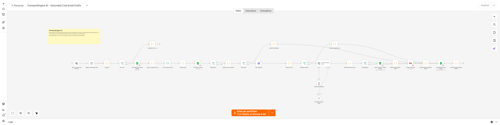

# OutreachEngine AI

Every Monday at 9:00 AM Manila time, or on a manual run, review a small batch of leads, create Gmail drafts for suitable leads, and stop.

These images show a local n8n editor. Red icons mean credentials still need to be connected on your own instance.

[Lead checks](screenshots/n8n-start.png) · [Draft and tracking steps](screenshots/n8n-finish.png)

## What it does

The Leads sheet is the input. The workflow keeps one lead per email in each batch. For each lead, it checks the email and HTTPS website, reads site text, and asks OpenAI to draft a message based on that text. It saves a row in Drafts and creates a Gmail draft only when the site and AI result are usable. It never sends the draft. A person must review the recipient, claims, and lawful reason to contact the lead before sending. It can write in English or Filipino when the lead's site supports that language.

Success means one Drafts row per valid email. A usable lead also has a Gmail draft. A lead with an unusable website or AI result has Needs human in the row and no draft. A bad email fails input validation. Sales operations owns this workflow.

## Set up

1. On self-hosted n8n, import OutreachEngine AI.json and Failure Alert.json. Connect OpenAI, Google Sheets, and Gmail credentials. Give the Google account access only to the needed spreadsheet and mailbox.
2. Make a Leads tab with these exact headers: Name, Email, Company, Title, Website, Offer. Make a Drafts tab with: Email, Name, Company, Website, Subject, Body, Flag, Reason, Updated At, Status.
3. Set COLD_EMAIL_SHEET_ID, COLD_EMAIL_SENDER_NAME, COLD_EMAIL_SENDER_COMPANY, COLD_EMAIL_OFFER, and OUTREACH_ALERT_EMAIL_TO in the server environment. Keep API keys in n8n credentials. Set N8N_BLOCK_ENV_ACCESS_IN_NODE=false on this dedicated instance so Code nodes can read workflow settings.
4. In the main workflow's n8n Settings, choose Failure Alert as its Error Workflow. Connect its Gmail node and test delivery to the sales operator.
5. Optional limits: OUTREACH_MAX_LEADS=5 and OUTREACH_MIN_SITE_WORDS=40. Keep the max low until test runs are reliable. Set N8N_SSRF_PROTECTION_ENABLED=true to block requests to private network addresses. Set N8N_CONCURRENCY_PRODUCTION_LIMIT=1 to reduce overlapping production runs; manual runs can still overlap.

OUTREACH_ENABLED=true allows a run. Dry run is on unless OUTREACH_DRY_RUN=false. Dry run stops before Sheets, web requests, OpenAI, and Gmail. Set OUTREACH_ENABLED=false and deactivate the workflow to stop new runs.

## Test before using real leads

1. Run python smoke_test.py after edits. It exits nonzero on failure. GitHub Actions runs it on pushes and pull requests.
2. Enable the flag and leave dry run on. Run manually; confirm dry_run and no external calls.
3. Use a test sheet and inbox, then set OUTREACH_DRY_RUN=false. Test one good site, an empty lead, and an unavailable site. Review the Drafts rows and Gmail draft.
4. Run the same lead again. It must not create another draft. Test that Failure Alert reaches the operator.

## If something fails

The workflow checks Drafts by email before fetching the site. For a usable lead it first saves Draft creation pending, then creates the Gmail draft, then changes the row to Draft created. A pending row may mean Gmail succeeded but the final sheet update failed. Check the n8n execution and Gmail Drafts before deciding what to do. Do not delete the row or rerun blindly after a Gmail timeout. A row marked Needs human needs manual review.

n8n logs the time, run ID, and result; Failure Alert emails OUTREACH_ALERT_EMAIL_TO. Website calls have a 15 second timeout and at most three attempts with a fixed two second wait. This generic n8n retry can also retry a permanent HTTP error; it is not selective backoff. Gmail and sheet writes are not automatically retried after an uncertain result. Sheets lookup and upsert do not prevent duplicates from simultaneous runs. Keep one operator run at a time and reconcile any duplicates.

If n8n is offline on Monday morning, the scheduled run is missed. Run it manually after recovery. Use an outside uptime monitor. Review the owner, offer, contact basis, and sheet every quarter; retire the workflow when outreach ends. A full test with account credentials is required before real leads.

## Go-live check

- [ ] Dry run was tested; it touched no live account.
- [ ] Secrets are in n8n credentials, and required environment settings are present.
- [ ] The same item was run twice in a test account with no duplicate side effect.
- [ ] Timeouts and retry limits were checked; uncertain Gmail or Sheets writes are reviewed by a person.
- [ ] Failure Alert reaches the named operator, and an outside monitor covers n8n outages.
- [ ] The operator knows how to set OUTREACH_ENABLED=false and deactivate the workflow.\n
