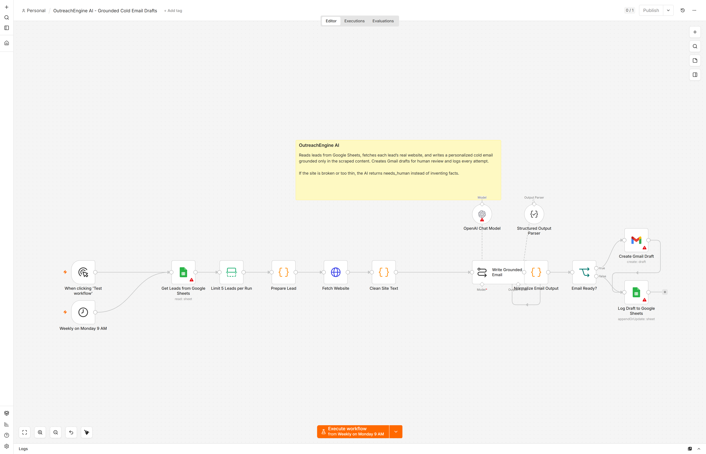

# OutreachEngine AI

An n8n workflow that reads leads from Google Sheets, fetches each lead's real website, and writes a personalized cold email grounded only in that content.

## What it does

1. Reads up to 5 leads per run from Google Sheets.
2. Fetches each lead's website.
3. Cleans the site text and checks whether it is usable.
4. GPT-5.6 Terra writes a personalized email using only facts from the site.
5. If the site is broken or too thin, the AI returns `needs_human` instead of inventing facts.
6. Ready emails become Gmail drafts for human review.
7. Every attempt is logged to Google Sheets.

Nothing is sent automatically. The workflow stops at drafts so you stay in control.

## Current tech

- n8n AI Agent (LangChain) nodes with structured output
- OpenAI GPT-5.6 Terra grounded-content prompting
- Website fetching with failure handling
- Gmail Drafts API
- Google Sheets upsert (no duplicate rows per email)

## Setup

1. Import `OutreachEngine AI.json`.
2. Set environment variables:

   | Variable | Purpose |
   |---|---|
   | `COLD_EMAIL_SHEET_ID` | Google Sheet ID |
   | `COLD_EMAIL_SENDER_NAME` | Sender name |
   | `COLD_EMAIL_SENDER_COMPANY` | Sender company |
   | `COLD_EMAIL_OFFER` | One-sentence offer |

3. Connect Google Sheets, OpenAI, and Gmail credentials.
4. Create two tabs:
   - `Leads`: `Name, Email, Company, Title, Website, Offer`
   - `Drafts`: `Email, Name, Company, Website, Subject, Body, Flag, Reason, Updated At, Status`
5. Activate the workflow.

